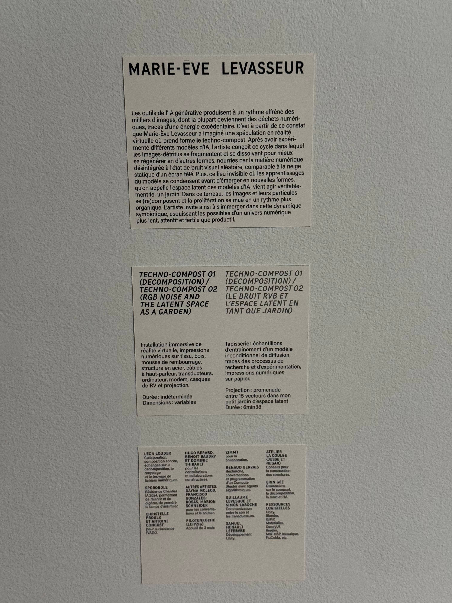
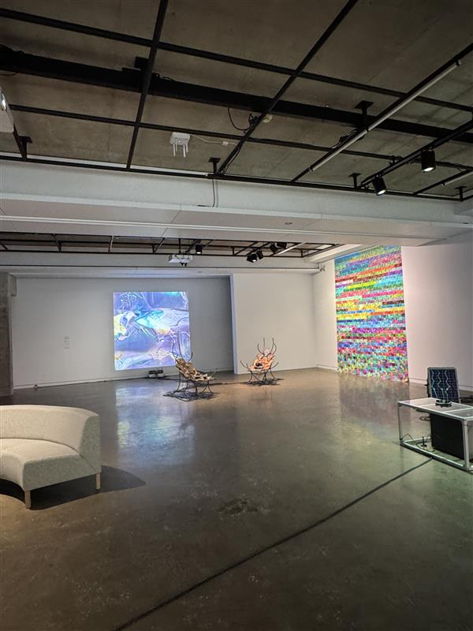
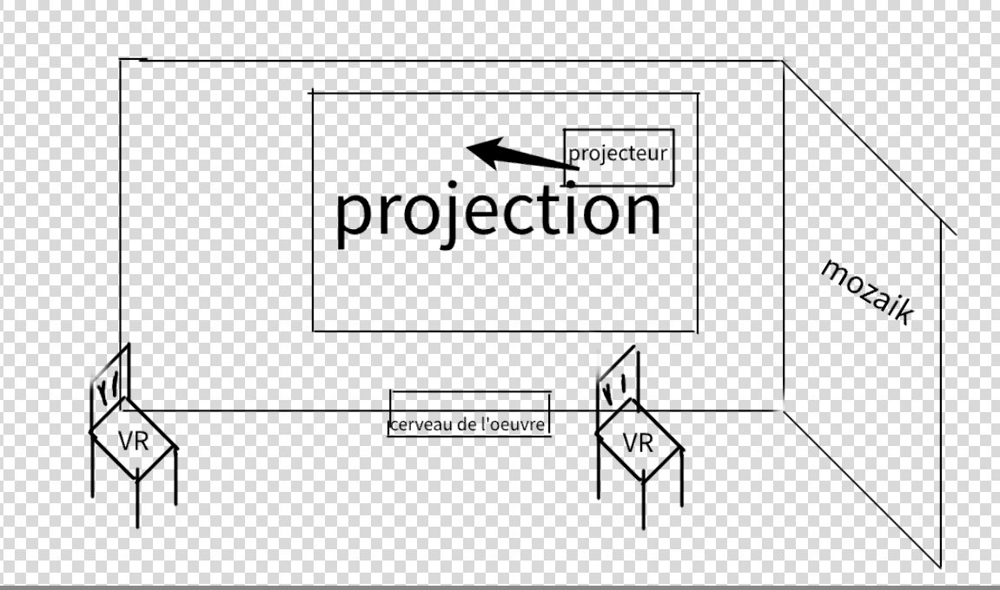

# TECHNO-COMPOST 01(DECOMPOSITION) /TECHNO-COMPOST 02(LE BRUIT RVB ET L'ESPACE LATENT EN TANT QUE JARDIN)
 

## Informations générales
- Nom de l’exposition / événement :TECHNO-COMPOST 01(DECOMPOSITION) /TECHNO-COMPOST 02(LE BRUIT RVB ET L'ESPACE LATENT EN TANT QUE JARDIN)
 
- Lieu de mise en exposition : UdeM
- Type d’exposition :(temporaire, intérieure,)
- Date de la visite : Janvier 30 2026
- Artiste ou firme : Marie-Eve Levasseur
- Année de réalisation : 2025

>Image de cartel de Marie-eve levasseur prise par Karim Elchoueiri 

---

## Description de l'œuvre ou du dispositif
Créée par Marie-Ève Levasseur en 2025, Techno-Compose 01 et 02 est une installation intérieure temporaire qui se compose de trois parties.
La première composante est un grand tableau de mosaïque formé d’images recyclées, évoquant le passage des déchets vers le compost, disposées de manière harmonieuse en un motif visuel captivant.
La deuxième partie est un projecteur dynamique qui projette des images sélectionnées, évoluant avec le temps pour renouveler l’expérience visuelle.
Enfin, la troisième composante comprend deux chaises équipées de casques de réalité virtuelle. L’une de ces chaises intègre des moteurs vibrants, offrant une immersion accrue. Le casque permet aux utilisateurs de saisir virtuellement les images, qui tombent, se transforment, et symbolisent la décomposition des déchets. L’autre chaise, quant à elle, propose simplement une immersion passive, laissant les images chuter dans un environnement qui simule le tri des déchets.

>Image de vue d'ensemble de l'oeuvre de Marie-Eve levasseur prise par Karim Elchoueiri 
---

## Type d’installation
-  ☐ Contemplative
- [x] Immersive
- [x] Interactive

Type d’installation et relation avec le public

L’installation est immersive et interactive. Le public est plongé dans un environnement visuel riche, où les images recyclées prennent vie. Les visiteurs interagissent directement via les casques VR et les vibrations, devenant acteurs de l’expérience. Ainsi, le lien avec l’œuvre et l’artiste se renforce à travers cette interaction et cette immersion.

---

## Fonction du dispositif multimédia
- [x] Scénographie
- [x] Mise en valeur
- [x] Mise en contexte
- ☐ Support pédagogique
- ☐ Diffusion du patrimoine immatériel

 La fonction de ce dispositif multimédia est immersive et interactive. Il permet de plonger le public dans un univers visuel riche, renforçant l’engagement personnel. Grâce aux interactions via les casques VR et les vibrations, le public devient acteur de l’œuvre. Cette approche, à la fois scénographique et pédagogique, met en contexte les enjeux du recyclage, tout en offrant une expérience sensible et mémorable.

---

## Mise en espace
Description de l’implantation de l'œuvre :

En entrant dans la galerie, on découvre d’abord une autre œuvre, puis celle de Marie-Ève Levasseur, qui est divisée en trois parties. D’abord, un projecteur montre des images générées par IA, mêlant insectes et motifs, projetées sur un mur blanc. Ensuite, à droite, un grand collage d’images non utilisées recouvre tout le mur. Au centre, il y a deux chaises en métal, en forme d’insectes, avec des casques VR reliés à un petit ordinateur sous la projection. Le public peut circuler, s’installer, et profiter de l’expérience, avec de l’espace libre pour bouger autour.

>Image de croquis de l'oeuvre de Marie-Eve levasseur faite par Karim Elchoueiri 
---

## Composantes et techniques
Liste des composantes de l'œuvre ou du dispositif :
- projecteur
- capteurs
- systèmes audio dans le VR
- structures physiques (chaise avec et sans moteurs de vibration)
- logiciels / technologies utilisées (inconue)
- papier (pour le mozaik d'images)

---

## Expérience vécue
Le visiteur, en entrant, est invité à explorer les différentes parties de l’œuvre. Il s’assoit sur les chaises avec les casques VR, et il peut interagir en touchant les images, en les agrandissant, et en explorant les détails. L’œuvre réagit en proposant des images nouvelles, créant une ambiance à la fois un peu sombre, mais aussi très lumineuse grâce aux couleurs. Personnellement, j’ai adoré l’idée derrière l’œuvre : transformer des images oubliées en mosaïque, tout en donnant au visiteur la possibilité de toucher et ressentir ces images d’une manière unique.

>Image de chaise de l'oeuvre de Marie-Eve levasseur prise par Karim Elchoueiri 
---

## ❤️ Ce qui m’a plu / inspiré
Ce qui m’a particulièrement plu dans cette œuvre, c’est la façon dont elle donne une seconde vie aux images abandonnées. L’idée de transformer ce qui est rejeté en une mosaïque pleine de sens est très puissante. Les casques VR, en plus, créent un lien fort entre le réel et le virtuel, ce qui rend l’expérience très immersive. Ce qui m’inspire, c’est cette capacité à raconter une histoire à travers des images simples, tout en donnant une dimension émotionnelle. Cela me pousse à réfléchir à mes propres projets, en explorant comment je pourrais utiliser des images ou des technologies immersives pour donner vie à des récits, à des souvenirs ou à des idées que je n’avais pas encore explorés.

---

## 🤔 Ce que je ne retiendrais pas ou ferais autrement 

Ce que je retiendrai moins, ce sont les chaises. Bien qu’elles soient en lien avec le thème des insectes, je les ai trouvées un peu inconfortables. De plus, la chaise avec les moteurs de vibration manquait un peu de puissance ; je ne ressentais pas autant les vibrations que je l’espérais lorsque j’étais allongé. Pour améliorer cela, j’aurais peut-être rendu les moteurs plus puissants ou retravaillé la forme des chaises pour les rendre plus ergonomiques. Malgré cela, l’expérience reste riche, mais ces ajustements auraient pu renforcer l’impact global.

---

## Références et crédits
- Site de l’exposition : https://galerie.umontreal.ca
- Site de l’artiste ou de la firme : https://www.sagamie.com/blogue/marie-eve-levasseur

