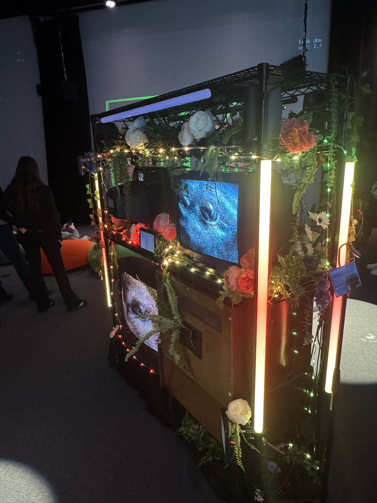
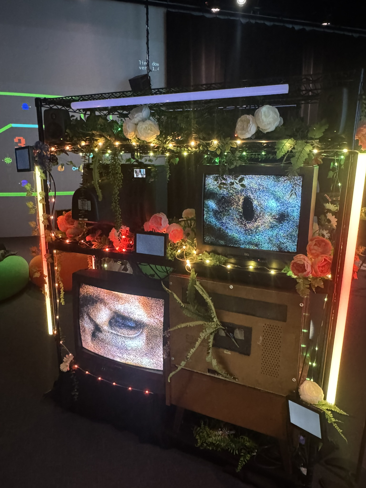
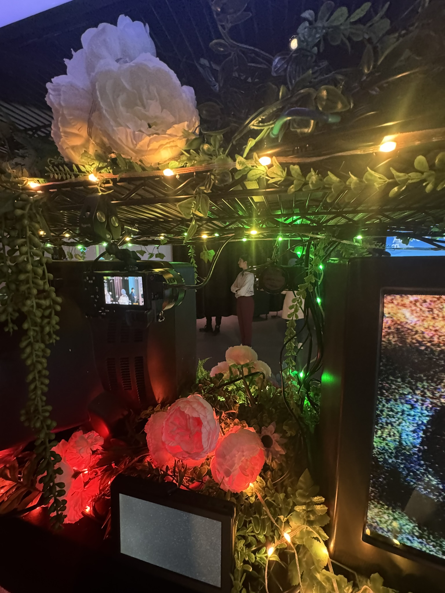
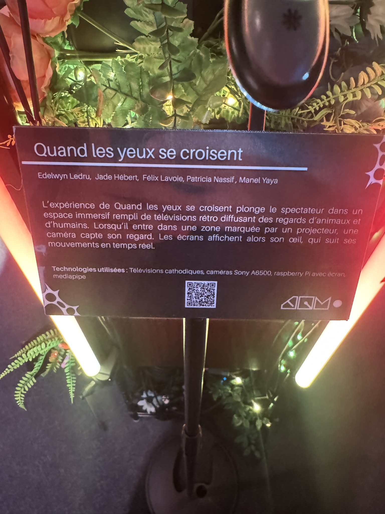
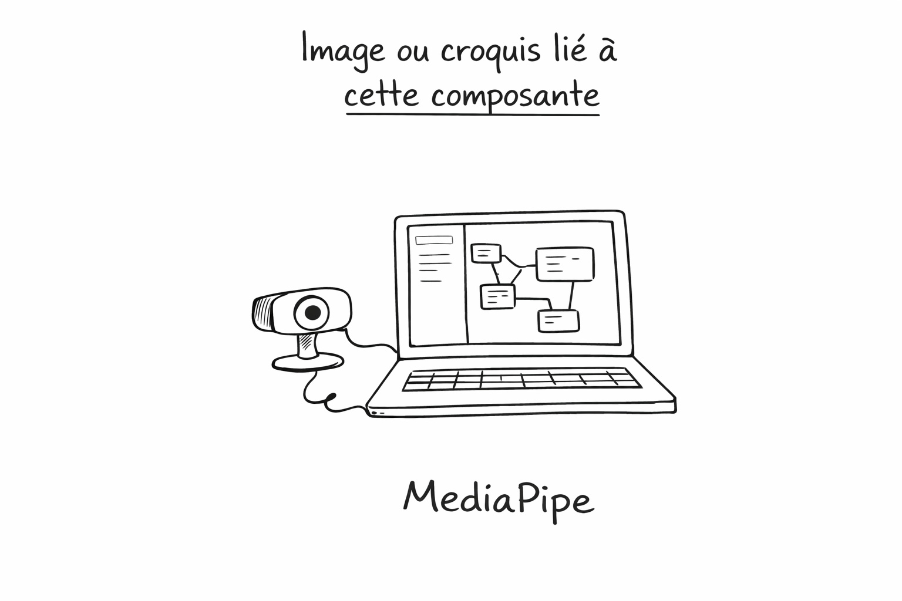

# Fiche – Réseau Vivant – Quand les yeux se croisent

## Nom de l’exposition
**Réseau Vivant**

Exposition des finissantes et des finissants du programme de **Techniques d’intégration multimédia** du Collège Montmorency. L’exposition a eu lieu au **Grand studio C-1712** et présentait plusieurs projets interactifs autour du thème de la connectivité, des échanges, des données et des émotions.

---

## Œuvre choisie
# Quand les yeux se croisent

### Créatrices et créateurs
- Edelwyn Ledru
- Jade Hébert
- Félix Lavoie
- Patricia Nassif
- Manel Yaya

---

## Pourquoi j’ai choisi cette œuvre
Parmi toutes les œuvres présentées, **Quand les yeux se croisent** est celle qui m’a le plus marqué. C’est mon projet préféré, parce qu’il crée immédiatement une réaction chez le spectateur. Le fait de voir son propre œil apparaître à l’écran rend l’expérience très personnelle et un peu troublante, mais aussi vraiment fascinante.

J’ai aussi aimé le mélange entre la technologie et l’esthétique visuelle. L’installation n’était pas seulement technique : elle était aussi belle à regarder. Les vieux téléviseurs, les lumières, les fleurs et les plantes créaient une ambiance très forte. Je trouve que cette œuvre réussit bien à mélanger **interactivité**, **mise en espace** et **émotion**.

---

## Description de l’œuvre
D’après le cartel de l’installation, **Quand les yeux se croisent** plonge le spectateur dans un espace immersif composé de télévisions rétro qui diffusent des regards d’animaux et d’humains. Lorsqu’une personne entre dans une zone précise, une caméra capte son regard. Les écrans affichent alors son œil et suivent ses mouvements en temps réel.

Je trouve que cette idée est très efficace, parce qu’elle transforme tout de suite le visiteur en partie intégrante de l’œuvre. On ne regarde pas seulement l’installation : on entre en relation avec elle.

---

## Technologies utilisées
Selon le cartel observé sur place, les technologies utilisées sont :

- télévisions cathodiques
- caméras Sony A6500
- Raspberry Pi avec écran
- MediaPipe

---

## Installation en cours / finale
L’installation finale prend la forme d’une structure centrale entourée de téléviseurs cathodiques, de tubes lumineux verticaux, de végétation artificielle et de fleurs décoratives. Plusieurs écrans montrent des yeux en gros plan, ce qui attire immédiatement le regard du visiteur. La caméra est intégrée à l’intérieur de la structure pour capter le regard de la personne qui s’approche.

### Photo de l’ensemble

*Légende : Vue d’ensemble de l’installation **Quand les yeux se croisent**, photo prise lors de l’exposition finale.*

### Photo de face

*Légende : Vue avant de l’installation avec les écrans cathodiques et les lumières.*

### Photo intérieure

*Légende : Vue intérieure de l’installation montrant la caméra et une partie du dispositif technique.*

### Cartel

*Légende : Cartel de l’œuvre présenté dans l’exposition.*

### Setup technique

*Légende : Poste technique du projet pendant la production, avec l’environnement de travail utilisé pour piloter l’installation.*

---

## Schéma de l’installation prévue
**À ajouter ici** le schéma de mise en espace ou de plantation si tu le télécharges depuis la documentation GitHub de l’équipe.

Exemple :

*Légende : Schéma de mise en espace du projet, source : documentation GitHub de l’équipe du projet.*

---

## Ce que j’ai ressenti pendant l’expérimentation
Avant même d’entrer dans l’installation, j’ai ressenti de la curiosité. Les vieux écrans, les lumières et la composition visuelle donnaient envie d’aller voir ce qui allait se passer.

Pendant l’expérience, j’ai ressenti un mélange d’étonnement, d’inconfort et de fascination. Voir un œil apparaître à l’écran en lien avec mes propres mouvements rendait l’expérience immersive et presque étrange. Ce n’était pas une interaction « gadget » : on sentait vraiment que le regard devenait le centre de l’œuvre.

Après l’avoir expérimentée, j’ai trouvé que le projet était très réussi, parce qu’il était à la fois :
- visuellement fort
- techniquement intéressant
- simple à comprendre pour le public
- marquant sur le plan émotionnel

C’est surtout pour cette raison que je l’ai classé en premier.

---

## Ce que je retiens de ce projet
Ce projet me montre qu’une installation interactive peut être très puissante même si l’interaction semble simple au départ. Ici, le regard devient un déclencheur très fort. Cela prouve qu’un bon concept, une bonne direction artistique et une intégration technique cohérente peuvent créer une expérience mémorable.

Je retiens aussi l’importance de la scénographie. Le projet n’aurait pas eu le même impact si les écrans, les lumières et les éléments décoratifs n’avaient pas été aussi bien intégrés.

---

## 3 cours du programme TIM qui me semblent incontournables
Selon la grille officielle du programme TIM du Collège Montmorency, plusieurs cours préparent directement à la création d’installations interactives. Parmi eux, voici les 3 qui me semblent les plus importants : **Programmation interactive (420 V11 MO)**, **Installation multimédia (582 521 MO)** et **Expérience multimedia (582 601 MO)**.

### 1. Programmation interactive
Ce cours est important pour comprendre comment faire réagir un dispositif aux actions du public. Dans un projet comme **Quand les yeux se croisent**, la logique interactive est essentielle, parce que l’œuvre doit détecter, analyser et répondre au comportement du visiteur.

### 2. Installation multimédia
Ce cours est incontournable parce qu’il prépare directement à concevoir des œuvres dans un espace physique. Il ne s’agit pas seulement de faire fonctionner la technologie, mais aussi de penser à l’intégration des écrans, des lumières, du son et du parcours du public.

### 3. Expérience multimedia
Ce cours me semble essentiel, car il regroupe plusieurs compétences du programme dans un projet final complet. Il demande de travailler en équipe, de passer du concept à la réalisation, puis de présenter le projet au public. C’est exactement l’esprit d’une œuvre comme celle-ci.

---

## Une technique ou composante technologique que je ne connaissais pas
La composante technologique que je connaissais moins est **MediaPipe**.

MediaPipe est un framework open source qui sert à construire des pipelines de perception en temps réel à partir de médias comme la vidéo. Il est utilisé pour détecter et analyser des informations visuelles rapidement, par exemple dans des flux caméra. Dans le contexte de ce projet, cela aide à comprendre comment le système peut capter le regard ou suivre certains mouvements pour produire une réponse interactive en direct.

### Image ou croquis lié à cette composante

*Légende : Poste technique associé au fonctionnement du projet. La photo montre l’environnement de production de l’installation.*

---

## Conclusion
**Quand les yeux se croisent** est l’œuvre qui m’a le plus inspiré dans l’exposition **Réseau Vivant**. J’ai aimé son côté immersif, sa force visuelle et la façon dont elle utilisait le regard comme point de contact entre le spectateur et la machine.

Pour moi, c’est un très bon exemple d’un projet multimédia interactif réussi, parce qu’il combine :
- une idée claire
- une scénographie forte
- une technologie pertinente
- une expérience marquante pour le public

---

## Sources
- Consignes du travail et informations demandées dans la fiche : document du cours fourni par l’enseignant.
- Page officielle de l’exposition **Réseau Vivant – 2026** : titres des projets, dates, lieu, contexte général.
- Grille officielle du programme **Techniques d’intégration multimédia** du Collège Montmorency.
- Informations observées directement sur le cartel et dans les photos prises sur place.
