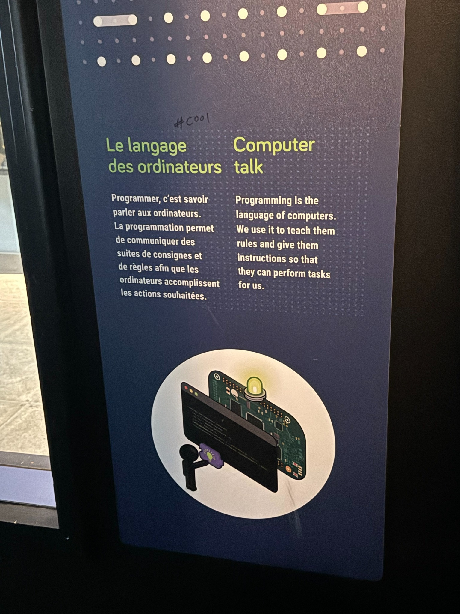
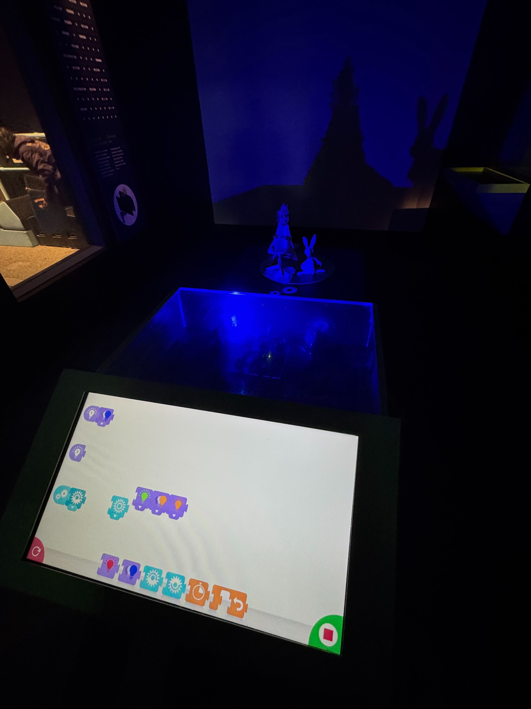
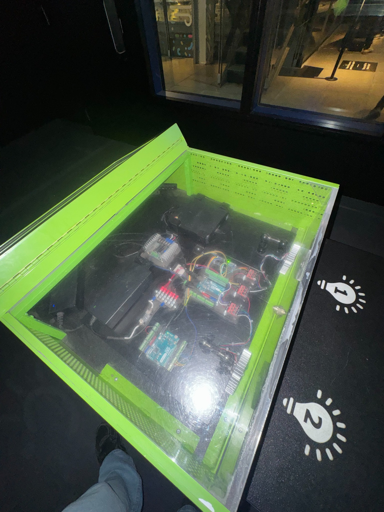
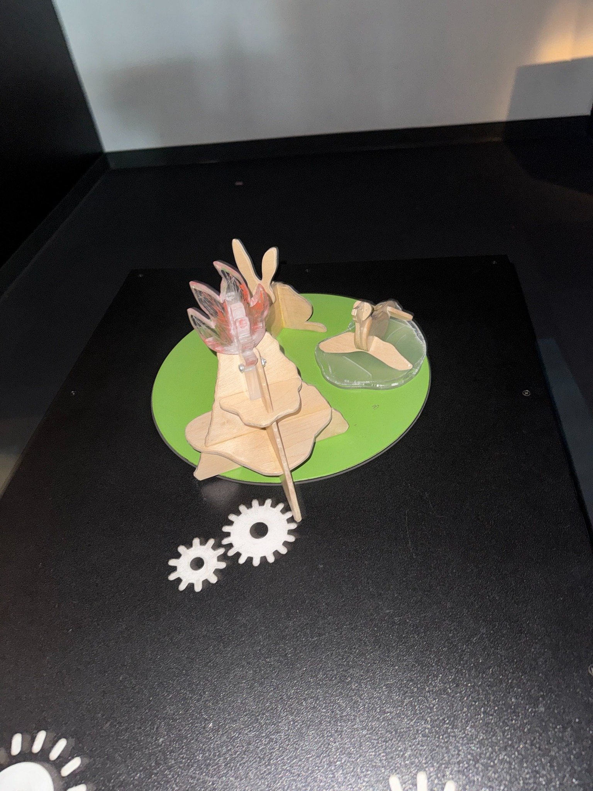
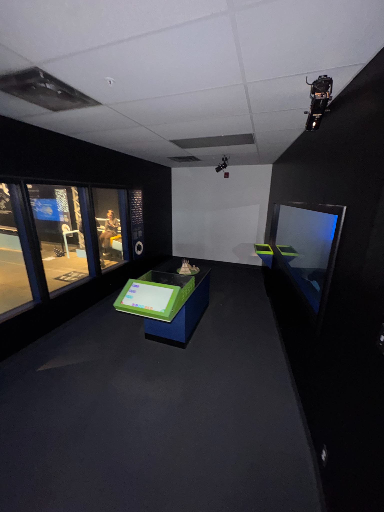
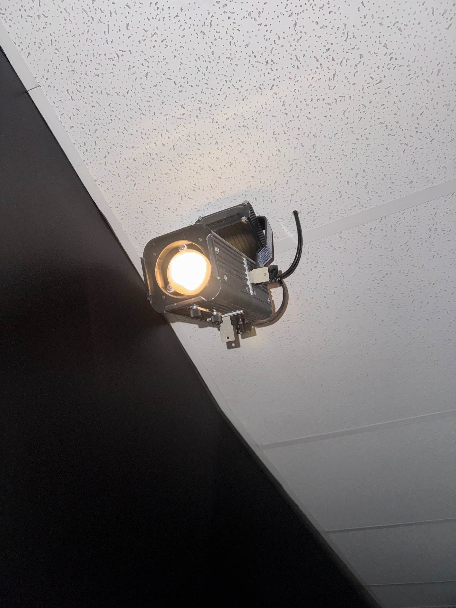

# Fiche de documentation – Explore – Le langage des ordinateurs

## 1. Identification du dispositif

**Nom de l’exposition :** Explore – La science en grand  
**Lieu :** Centre des sciences de Montréal  
**Dispositif choisi :** Le langage des ordinateurs  
**Zone de l’exposition :** Programmez le futur  

---

## 2. Description générale

Le dispositif **Le langage des ordinateurs** est une installation interactive.  
Il montre que programmer veut dire donner des consignes à une machine pour qu’elle fasse une action.

Dans la salle, on peut voir :

- un écran tactile pour créer des commandes;
- des projecteurs au plafond;
- un mur de projection;
- des petits objets physiques au centre;
- un boîtier vitré avec des composantes électroniques;
- des lumières et des projections qui réagissent aux commandes.

L’installation est placée dans une petite salle sombre, ce qui rend l’expérience plus immersive.

---

## 3. Fonctionnement observé

Le visiteur utilise l’écran tactile pour créer une suite d’actions.  
Ensuite, le système exécute les commandes dans l’espace.

Pendant mon essai, je pouvais contrôler :

- des lumières;
- des projections;
- des petits modèles qui bougent.

Le résultat ressemblait à une petite fête visuelle, parce que plusieurs éléments réagissaient en même temps.

Ce dispositif montre bien le lien entre une commande numérique et une réaction physique.

---

## 4. Expérience utilisateur

L’expérience est simple et interactive.  
Le visiteur ne fait pas seulement regarder : il participe directement.

J’ai trouvé le dispositif intéressant, parce qu’il rend la programmation plus facile à comprendre.  
Au lieu de voir seulement du code, on voit directement les effets des commandes.

Cela aide à comprendre que le langage des ordinateurs sert à faire exécuter des actions précises.

---

## 5. Intention de communication

Selon moi, le but du dispositif est de montrer que la programmation n’est pas quelque chose de trop compliqué.  
Programmer, c’est donner des instructions claires à une machine.

Le dispositif est bien placé dans la zone **Programmez le futur**, car cette zone parle de programmation, d’objets connectés, de réalité augmentée et d’intelligence artificielle.

L’installation explique ce concept avec une approche visuelle, amusante et interactive.

---

## 6. Analyse visuelle et technique

Visuellement, la salle sombre permet de bien voir :

- les lumières;
- les projections;
- les objets en mouvement;
- l’interface numérique.

On peut aussi observer plusieurs éléments techniques :

- l’écran tactile;
- les projecteurs;
- la surface de projection;
- la maquette centrale;
- le boîtier électronique;
- les câbles et les cartes électroniques.

Le boîtier vitré est intéressant, parce qu’il montre qu’il y a un vrai système technique derrière l’interaction.

---

## 7. Mise en espace

La mise en espace est claire et efficace.

Le visiteur entre dans une petite salle sombre.  
L’écran tactile est placé à l’avant pour contrôler le dispositif.  
Les petits modèles sont au centre, comme une petite scène.  
Les projecteurs et les lumières ajoutent ensuite les effets visuels.

Le fonctionnement peut se résumer ainsi :

1. le visiteur entre une commande;
2. le système comprend la commande;
3. l’espace réagit avec de la lumière, du mouvement ou une projection.

---

## 8. Forces du dispositif

Les forces du dispositif sont :

- il est très interactif;
- il est facile à comprendre;
- il relie le numérique au physique;
- il est amusant;
- il donne envie d’essayer plusieurs commandes.

---

## 9. Limites observées

Il y a aussi quelques limites.

Comme la salle est sombre, certains détails sont plus difficiles à voir.  
Aussi, le visiteur peut comprendre l’effet général sans comprendre complètement toute la logique de programmation.

Le dispositif est donc très bon pour introduire le concept, mais il explique moins en profondeur le côté technique.

---

## 10. Appréciation personnelle

J’ai aimé ce dispositif parce qu’il était original, simple et interactif.

J’ai aimé pouvoir contrôler des éléments avec l’écran tactile.  
C’était intéressant de voir que mes actions provoquaient une réaction directe dans la salle.

Pour moi, cette installation montre que la programmation peut servir à contrôler des objets, des lumières, des images et des mouvements.

---

## 11. Conclusion

Le dispositif **Le langage des ordinateurs** est une installation interactive réussie.  
Il explique simplement qu’un ordinateur agit quand on lui donne des instructions précises.

Grâce à l’écran tactile, aux projections, aux lumières et aux objets en mouvement, le dispositif transforme la programmation en expérience concrète.

Cette installation s’intègre bien dans l’exposition **Explore – La science en grand**, car elle permet d’apprendre en expérimentant.

---

## 12. Documentation visuelle

> Place toutes tes images dans un dossier nommé `medias`.  
> Exemple : `ton-projet/medias/panneau-explicatif.jpg`

### Panneau explicatif

< ** Panneau explicatif du dispositif *Le langage des ordinateurs*. >

### Interface de contrôle

**Légende :** Écran tactile utilisé pour programmer les actions du dispositif.

### Boîtier électronique

**Légende :** Boîtier vitré qui montre une partie des composantes électroniques.

### Maquette centrale

**Légende :** Petits modèles physiques placés au centre de l’installation.

### Vue d’ensemble de l’espace

**Légende :** Vue générale de l’espace interactif.

### Projecteur au plafond

**Légende :** Projecteur utilisé pour créer les effets visuels.

---

## 13. Sources

- [Centre des sciences de Montréal – Explore – La science en grand](https://www.centredessciencesdemontreal.com/exposition-permanente/explore)
- Photographies personnelles prises lors de la visite
