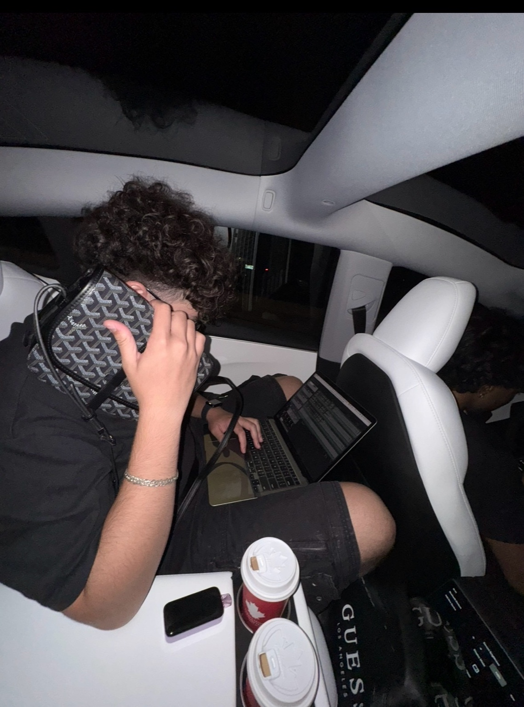

# Présentation de Karim Elchoueiri

Salut, mon nom est Karim Elchoueiri.  
Je suis dans ma quatrième session dans la technique d’intégration multimédia ici à Montmorency.

Une chose qui m’inspire dans cette technique est le graphic design. Ce qui m’inspire aussi ce sont des applications telles qu’Instagram et Pinterest, car je découvre de nouvelles idées ou techniques pour élargir mon inspiration afin de créer des choses plus originales et pas seulement copier-coller ce que les autres font.

# voici un lien de page instagram qui m'inspire dans le domaine de graphique design.
cette page est une inspiration car elle est vraimet mon style de design. Elle partage mes preference dans le design gragique et je trouve toujours des nouvelles idees dedans.

https://www.instagram.com/dsgn.verse/
