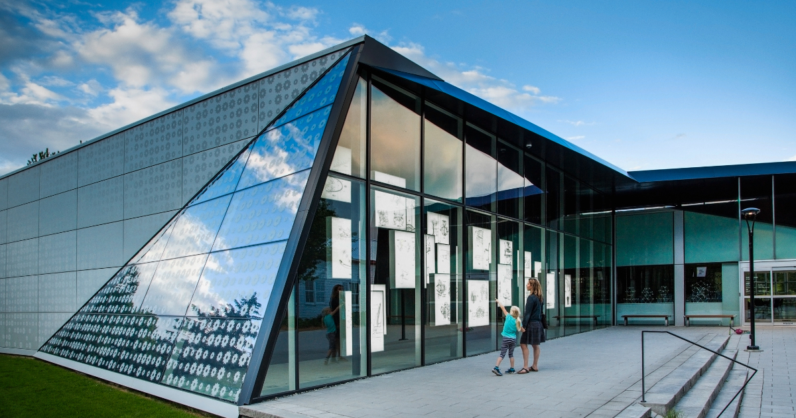
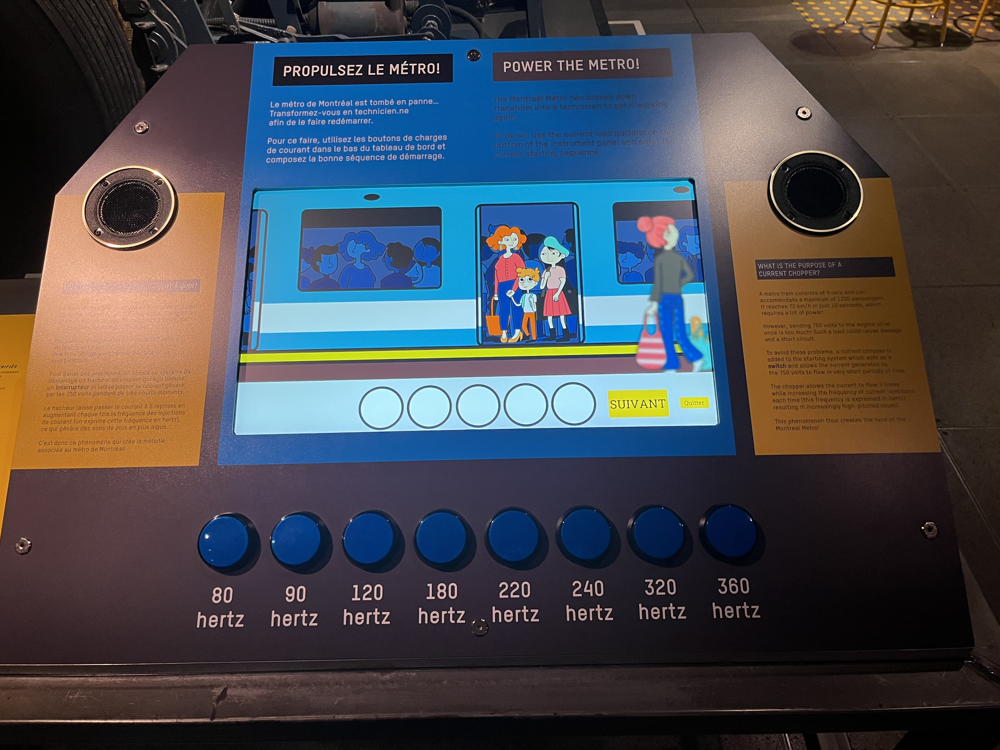

# Compte-rendu de la conférence au Musée de l’ingéniosité

## Rencontre avec Martin Boucher, technicien multimédia

*Dispositif interactif de l’exposition permanente. Source : Musée de l’ingéniosité J. Armand Bombardier, image « expo-permanente-scaled.jpg ».*

Dans cette conférence, Martin Boucher, technicien multimédia au Musée de l’ingéniosité J. Armand Bombardier, a présenté son travail et le fonctionnement de plusieurs dispositifs multimédias de l’exposition permanente. Son rôle comprend la prise de photos, la vidéo, le montage, l’installation et l’entretien des équipements interactifs.

Il a d’abord expliqué que le musée utilise plusieurs moyens pour rendre la visite plus dynamique, comme des photobooths, des projections, des écrans et des activités interactives. Martin a aussi parlé des défis techniques liés à ces installations. Certains équipements coûtent très cher, comme des projecteurs pouvant atteindre près de 10 000 $, ou des ampoules de remplacement qui peuvent coûter environ 1 500 $ US. Pour cette raison, le musée choisit parfois des appareils plus économiques.
| Bogie du métro | Dispositif interactif du métro |
|---|---|
|  |  |
| *Bogie du métro présenté dans l’exposition permanente du Musée de l’ingéniosité J. Armand Bombardier. Photo prise par Sylvie François.* | *Dispositif interactif « Propulsez le métro », présenté dans l’exposition permanente du Musée de l’ingéniosité J. Armand Bombardier. Photo prise par Sylvie François.* |

La conférence a ensuite présenté des exemples précis, comme la salle du garage de Bombardier. Cette salle comprend plusieurs activités, cinq projecteurs et trois haut-parleurs placés autour de l’espace pour créer un effet sonore immersif. Elle contient aussi de vraies pièces historiques. Martin a également montré le dispositif du bogie du métro, lié aux roues du métro de Montréal. L’activité permet de comprendre comment le son du métro est produit grâce au courant envoyé dans les moteurs.

J’ai trouvé cette conférence intéressante, car elle montrait le côté technique caché derrière les expositions. Elle m’a permis de mieux comprendre l’importance de l’entretien, du son, de l’image et des logiciels comme Max/MSP, Notch, MadMapper et TouchDesigner dans un musée interactif.
